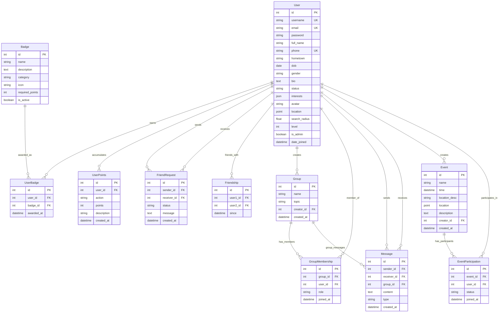

# VietCom - Entity Relationship Diagram (ERD)

## Simplified Database Schema



## Entity Details

### 🧑‍💼 **User (Central Entity)**
```sql
-- Core user information with gamification and location features
User:
- id (Primary Key)
- username (Unique)
- email (Unique) 
- phone (Unique)
- full_name, hometown, dob, gender, bio
- status (online/offline)
- interests (JSON array)
- avatar (Image)
- location (Geographic Point)
- search_radius (Float)
- level (Integer - gamification)
- is_admin (Boolean)
```

### 🎮 **Gamification System**

#### **Badge**
```sql
-- Achievement badges with categories
Badge:
- id (PK)
- name, description
- category (social/event/activity/special)
- icon (Emoji/icon class)
- required_points (Integer)
- is_active (Boolean)
```

#### **UserBadge (Junction Table)**
```sql
-- Many-to-Many: User ↔ Badge
UserBadge:
- id (PK)
- user_id (FK → User)
- badge_id (FK → Badge)
- awarded_at (DateTime)
-- Constraint: UNIQUE(user_id, badge_id)
```

#### **UserPoints**
```sql
-- Point transaction log
UserPoints:
- id (PK)
- user_id (FK → User)
- action (login/event_create/event_join/friend_add/message_send/profile_complete)
- points (Integer - can be negative)
- description (String)
- created_at (DateTime)
```

### 👥 **Social System**

#### **FriendRequest**
```sql
-- Friend request workflow
FriendRequest:
- id (PK)
- sender_id (FK → User)
- receiver_id (FK → User)
- status (pending/accepted/rejected)
- message (Text - optional)
- created_at (DateTime)
-- Constraint: UNIQUE(sender_id, receiver_id)
```

#### **Friendship**
```sql
-- Established friendships
Friendship:
- id (PK)
- user1_id (FK → User)
- user2_id (FK → User)
- since (DateTime)
-- Constraint: UNIQUE(user1_id, user2_id)
```

#### **Group**
```sql
-- Chat groups/communities
Group:
- id (PK)
- name (String)
- topic (String - optional)
- creator_id (FK → User)
- created_at (DateTime)
```

#### **GroupMembership (Junction Table)**
```sql
-- Many-to-Many: User ↔ Group
GroupMembership:
- id (PK)
- group_id (FK → Group)
- user_id (FK → User)
- role (member/admin)
- joined_at (DateTime)
-- Constraint: UNIQUE(group_id, user_id)
```

#### **Message**
```sql
-- Chat messages (1-to-1 and group)
Message:
- id (PK)
- sender_id (FK → User)
- receiver_id (FK → User, nullable) -- For 1-to-1 messages
- group_id (FK → Group, nullable)   -- For group messages
- content (Text)
- type (text/image/sticker/location)
- created_at (DateTime)
-- Note: Either receiver_id OR group_id must be set, not both
-- Note: Location data can be stored in content for location type messages
```

### 📅 **Event System**

#### **Event**
```sql
-- Social events/meetups
Event:
- id (PK)
- name (String)
- time (DateTime)
- location_desc (String)
- location (Geographic Point)
- description (Text)
- creator_id (FK → User)
- created_at (DateTime)
```

#### **EventParticipation (Junction Table)**
```sql
-- Many-to-Many: User ↔ Event
EventParticipation:
- id (PK)
- event_id (FK → Event)
- user_id (FK → User)
- status (joined/interested)
- joined_at (DateTime)
-- Constraint: UNIQUE(event_id, user_id)
```

## Relationship Summary

### **One-to-Many Relationships**
- User → UserPoints (1:N)
- User → FriendRequest as sender (1:N)
- User → FriendRequest as receiver (1:N)
- User → Group as creator (1:N)
- User → Event as creator (1:N)
- User → Message as sender (1:N)
- User → Message as receiver (1:N)
- Group → Message as group (1:N)

### **Many-to-Many Relationships** (via Junction Tables)
- User ↔ Badge (via UserBadge)
- User ↔ Group (via GroupMembership)
- User ↔ Event (via EventParticipation)
- User ↔ User (via Friendship)

### **Business Rules**

#### **Social Rules**
- Cannot send friend request to yourself
- Cannot be friends with yourself
- One friend request per user pair
- One group membership per user per group

#### **Event Rules**
- Event time must be in future
- Creator cannot participate in own event
- Cannot join past events
- One participation per user per event

#### **Message Rules**
- Message must have either receiver OR group (not both)
- Group messages must have valid group membership

#### **Gamification Rules**
- Badge points cannot be negative
- User points can be negative (penalties)
- One badge award per user per badge
- Complete point transaction history

## Technical Implementation

### **Database Engine**
- **PostgreSQL** with **PostGIS** extension (for GeoDjango)

### **Key Indexes**
- User: email, username, phone
- All datetime fields: created_at, joined_at, awarded_at
- Geographic fields: location (spatial indexes)
- Foreign keys: Automatic indexes

### **Data Integrity**
- Unique constraints on junction tables
- Foreign key constraints with appropriate CASCADE/SET_NULL
- Custom validation in Django models

### **Scalability Features**
- Efficient geographic queries via PostGIS
- Point transaction log for complete audit trail
- Proper indexing for social graph queries
- JSON field for flexible interests storage

## Statistics
- **Total Entities**: 9
- **Junction Tables**: 4 
- **Geographic Fields**: 2
- **Foreign Key Relations**: 15
- **Unique Constraints**: 8
- **Choice Fields**: 7
